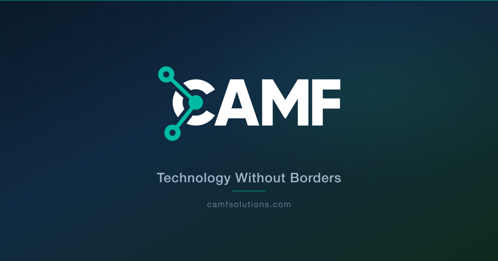

  

---

## CAMF Solutions

**AI consulting and technology ramp-up for small and mid-sized businesses.**

We help SMBs adopt AI through fixed-price readiness sprints, 90-day pilots, and ongoing operator retainers, and we keep the rest of their stack running: fractional tech leadership, web and e-commerce builds, and managed operations.

## What we do

- **[AI Consulting & Ramp-Up](https://camfsolutions.com/services/ai-consulting/)**: 2-week Readiness Sprint, 90-day AI Pilot, then an ongoing AI Operator retainer. We don't favor any model provider.
- **[Fractional Tech Leadership](https://camfsolutions.com/services/fractional-tech-leadership/)**: fractional CTO, AI advisor on retainer, digital transformation roadmap.
- **[Web & Digital Presence](https://camfsolutions.com/services/web-and-digital-presence/)**: get online, sell online, or keep your existing stack healthy.
- **[Managed Operations](https://camfsolutions.com/services/managed-operations/)**: hosting, maintenance, monitoring, SEO, optional GDPR add-on.
- **[Landing Page Subscription](https://camfsolutions.com/services/landing-page-subscription/)**: a professional landing page with hosting and domain included, monthly content updates, and support over WhatsApp and email.
- **[Drupal Support](https://camfsolutions.com/services/drupal-support/)**: monthly Drupal/CMS support retainers with security patching, uptime monitoring, and development hours.

## Where we work

🇺🇸 **Headquarters: Sheridan, Wyoming** · US C-corporation, US contracts and billing.
🌍 **US & Europe** · Our team covers US and European time zones and works in English, Spanish, and Italian. For businesses operating in both markets, we provide GDPR-aware engineering, multi-jurisdiction infrastructure, and multilingual delivery.

## Tech stack

`React` · `Next.js` · `Astro` · `Angular` · `Node.js` · `TypeScript` · `Python` · `PostgreSQL` · `Drupal` · `WordPress` · `GraphQL` · `Tailwind CSS` · `AWS`

## Also from CAMF

**[CAMF App](https://camf.app)**: a SaaS platform for travel agencies covering quotations, reservations, CRM, and no-code automation.

## Get in touch

🌍 **[camfsolutions.com](https://camfsolutions.com)**
📧 **info@camfsolutions.com**

  © CAMF Solutions Inc. · Sheridan, Wyoming

